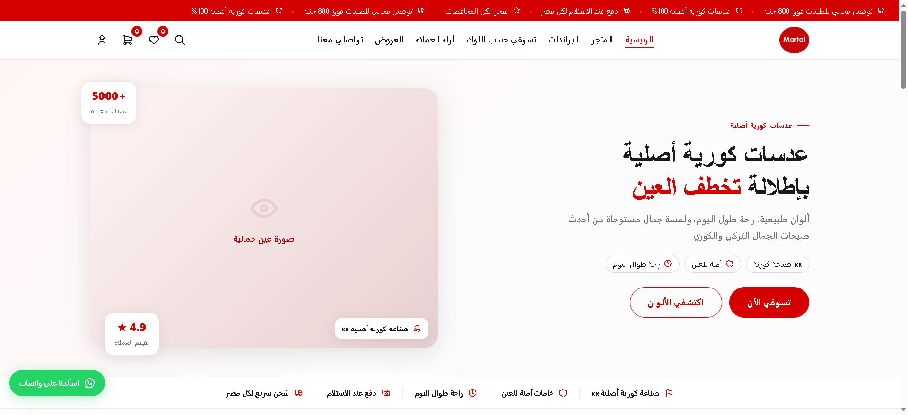
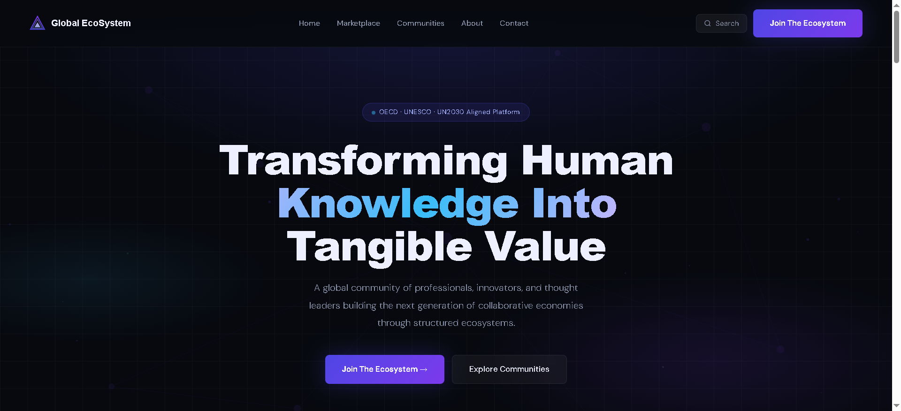

# OmniStack — Abdelrahman Hassan's Portfolio

> Junior Frontend & WordPress Developer — Cairo/Istanbul
> Live: [portfolio-sigma-ivory-gs3uzrer88.vercel.app](https://portfolio-sigma-ivory-gs3uzrer88.vercel.app)

---

## About

This is my personal portfolio — built to show real client work, not tutorial projects.
Every project listed was built for an actual business, deployed to production, and refined based on real feedback.

The portfolio itself is also a project. It was built with performance, accessibility, and craft in mind:
- **100/100** Lighthouse scores on desktop across all four metrics
- **97/100** Performance on mobile
- A full cinematic motion system built in three phases using Framer Motion

---

## Tech Stack

| Layer | Technology |
|---|---|
| Framework | Next.js 14 (App Router) |
| Styling | Tailwind CSS |
| Motion | Framer Motion 12 |
| Language | TypeScript |
| Fonts | Cormorant Garamond, DM Sans, Amiri |
| Deployment | Vercel |

---

## Features

**Motion System — "The Desert Reveals What Endures"**
- Sand particle canvas (70 wind-blown particles, canvas API)
- SVG dune silhouettes with parallax drift (3 layers)
- Heat haze via SVG `feTurbulence` displacement filter
- Arabic calligraphy element (الصبر) — rotating, floating, breathing
- Spring-physics cursor orb
- Hero letter emergence with Arabic character flash (per-character stagger)
- clipPath excavation scroll reveals across all pages
- Mirage dissolve page transitions (bleach exit, crystallize enter)
- Section-specific Arabic glyphs (ع, ح, ر, م)
- Card shimmer sweep + SVG border trace on hover
- Cursor-position radial gradient ripple on buttons
- Nav underline growing from center outward with spring overshoot

**Performance**
- Next.js Image optimization on all project screenshots
- `will-change: transform` scoped correctly
- All scroll animations fire `once: true` — no re-trigger on scroll up
- Fixed background layers use `pointer-events: none` throughout
- `overflow-x-hidden` on body — zero horizontal scroll

**Accessibility**
- WCAG AA contrast on all text (100 Lighthouse accessibility score)
- Semantic HTML throughout
- All images have descriptive `alt` text
- Keyboard-navigable

---

## Projects Featured

| Project | Type | Live |
|---|---|---|
| Martal Lens | WooCommerce store — contact lens retail | [martallens.com](https://martallens.com) |
| Safira Pharmacy | E-commerce + branding — pharmacy | [safiravitamin.com](https://safiravitamin.com) |
| Global EcoSystem | Custom WordPress platform — UN/UNESCO aligned | [theges.world](https://theges.world) |

---

## Screenshots

### Homepage


### Projects Page


---

## Local Development

```bash
git clone https://github.com/firoapo01/[repo-name]
cd [repo-name]
npm install
npm run dev
```

Open [http://localhost:3000](http://localhost:3000)

---

## Contact

- Email: abowael0112@gmail.com
- LinkedIn: [linkedin.com/in/abdelrahman-hassan-0b81a717b](https://linkedin.com/in/abdelrahman-hassan-0b81a717b)
- GitHub: [github.com/firoapo01](https://github.com/firoapo01)

---

*Built with HTML, CSS & JavaScript — and a lot of desert wind.*
